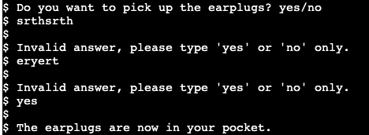

# Adventureland

[View the app in Heroku here](https://adventureland-ana.herokuapp.com/)

## Table of Contents

1. [How to Play](#How-to_play)
2. [Features](#Features)
3. [Data Model](#Data-Model)
4. [Testing](#Testing)
5. [Deployment](#Deployment)
6. [Credits](#Credits)

## How to Play

Adventureland starts with the player been asked their name and then they get introduced to the story. They are the main character and do not remember what happened. The last memory is of them being in the street with some friends and then everything became blurry. The player wakes up in an empty room and straight away gets asked what actions s/he wants to take to get out of there. The player will go from room to room and will get to choose what items to pick, what items to use and what doors to go through in order to survive and get out of the place.

#### Solutions to Riddles
- Firebird riddle: the solution is "name" or "your name";
- Sorcerer riddle: the solution is "rainbow";

## Features
#### Existing Features
- The voice of the game guides the player throught the different rooms;

- The player plays against him/herself;
- If the player dies they can choose to restart the game or not;

- Answers validation: 
    - Riddles: the player needs to provide the correct answers to keep playing;
    - When a specific answer is not provided the player is prompted again;

- Objects: the player needs to collect objects in order to get out of the house;

#### Future Features
- Introduce new levels to increment the level of difficulty;
- Add a map for the player to know where they are;
- Add a score tab;
- Be able to freely move back and forth inside the house;

## Data Model

Before starting to code the game I did have a look to written adventure games like the classic [The Dreamhold](https://eblong.com/zarf/zweb/dreamhold/) and decided what I wanted to inlcude in mine. The final decision for Adventureland was as per below:

The different rooms have been created using functions, to connect them they call each other depending on what the player's interaction is. 

In regards of the objects collected in the different rooms, those are collected in a dictionary with boolean values. The value is set to 'False' by default and if the object is collected it changes to 'True', allowing the player to use it when necessary (if they have collected, of course).

After having worked on the flowchart planned and had all the code working as expected, I analysed the quality of the code. I noticed that if in the future I want to add more rooms and extra levels of difficulty I will need to change how the code is organised. At the moment the logic of the game and the room's specifications are mixed together within the functions, this makes very difficult to have a biggest amount of rooms because the code would become very complex pretty soon. After analysing and investigating further I believe the best option is, on one hand, to create a dictionary from one side specifying the rooms characteristics and, on the other hand, to create the functions with the games' logic (i.e. what happens if an incorrect answer is entered, what happens when the player goes into a particular room). This would allow to create a much complex set of rooms in each level as well as creating different levels of difficulty.

## Testing

The game is been manually tested by doing the following:
- Tested the game in Gitpod by providing incorrect data (i.e. answering other than 'yes' or 'no' when those were the only accepted answers) to check the game flow could be followed;
- The game is also tested in Heroku to check all the expected behaviours described above were also true;

#### Bugs

While coding the game there was a few issues with the if loop to get the expected answer from the player, an infinite loop was created. This was corrected by using an 'input' statement rather than a 'print' so the player could modify their answer rather than repeting the whole function again.

When playing the words get splitted in the Heroku app, a solution could not be found into this.

#### Remaining Bugs

At the time of testing there were no bugs left.

#### Validator Testing

- Used [PEP8online.com](http://pep8online.com/) and no errors were returned.

## Deployment

The project is been deployed to Heroku.

Steps for deployment:
- Install dependencies in the requirements.txt file;
- Check the Procfile to ensure a correct deployment to Heroku;
- Create a new app in Heroku: choose a unique name and region;
- No sensitive data needed to be kept secret so nothing was added in the config Var tab;
- Add necessary buildpacks: Python and NodeJS in this order;
- For deployment method, GitHub was selected and confirmed we want to connect to GitHub;
- Connect Heroku to the repository for Advertureland;
- Set "Enable Automatic Deploys" to allow automatic deployments every time the code is pushed;
- Click on Deploy.

## Credits
- [Lucidchart](https://www.lucidchart.com/pages/) to create the flowchart;
- [Stackoverflow](https://stackoverflow.com/) and [GeeksforGeeks](https://www.geeksforgeeks.org/) for debugging.

[Back to Top ⇧](#Adventureland) 